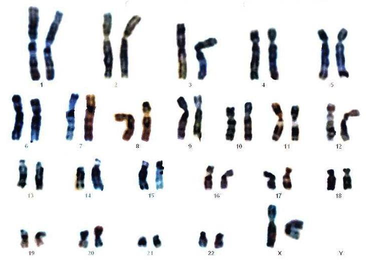
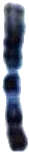
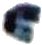
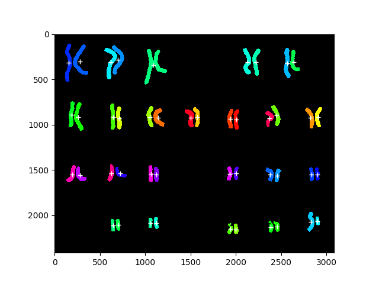

# Karyogram-Extraction

A script to extract chromosomes from karyograms and save them individually or as chromosome pairs. It is currently limited to a normal amount of chromosomes, i.e. 46. It only works on standard karyograms that contain 4 rows of chromosomes, whereas the rows contain chromosome 1-7, 6-12, 13-18, 19-X/Y respectively.

## Usage

Three folders are needed: A source folder where the karyograms are located, a folder where the extracted chromosomes are going to be saved, and a fail folder that saves intermediate representations of the algorithm for failed extractions, which can be used to adapt the parameters or spot a genome with mutations. These paths have to be set in the `script.py` file. Afterwards, simply execute the script which will process all the images in the source folder automatically.

#### Arguments:

*Located in the beginning of the script:*

**pair:** True, if chromosome pairs are supposed to be extracted. False for single chromosomes.

**min_volume:** The minimum pixel volume a chromosome is supposed to have. Good for removing numbers, letters etc. Standard: a chromosome has to occupy 0.003% of the images pixels.

**padding:** Padding around the chromosomes.

## Example

Here you can see some example for some successful and failed extractions. The images can be found in the  `extracted` and `fails` folder. Example karyograms are from Wikipedia.

### Successful Extraction

#### Karyogram

#### Extracted chromosomes

**Left chromosome 1**

**Right X chromosome**

### Failed Extraction

An example of a failed extraction. We can see that chromosome three was detected as a single component, indicated by the single + and identical color. Resulting in only 45 single chromosomes being detected. Unfortunately, some of the chromosome are inseparable due to the employed methods here (Connected Component Analysis). The morphological kernel in this case could be adapted, however, this often results in splitting chromosomes elsewhere, which makes it hard to find to find the optimal set of parameters for every type of chromosome.

## Naming Convention
 Extracted chromosomes are named in the following manner:

**A_B_CCCC.jpg**

  - A is the chromosome number from 1 to 23, where no. 23 is either X or Y chromosome (no differentiation between both is currently done.)
  - B shows encodes if it is the left (=1) or the right (=2) chromosome of the pair. If chromosomes pairs are extracted B=12
  - CCCC the original karyogram file name where the chromosomes were extracted from
